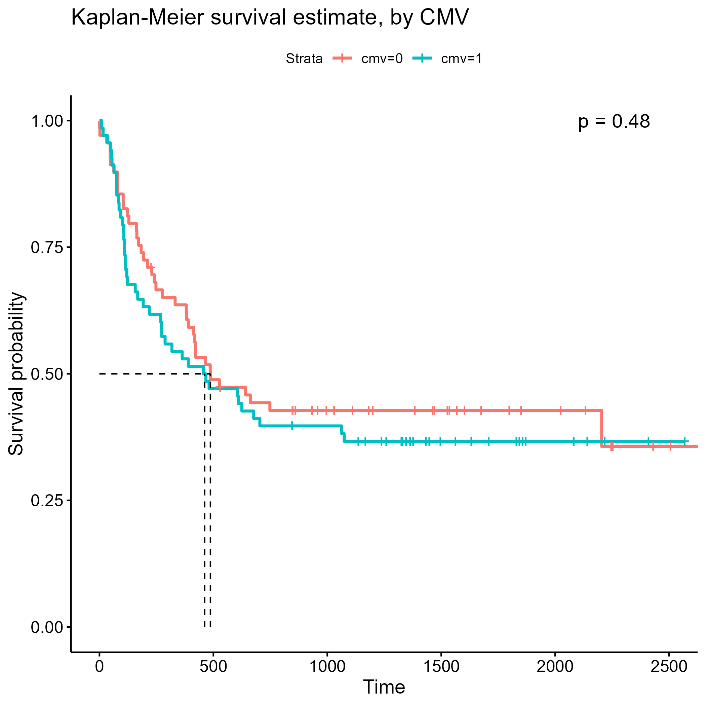

\fontsize{11}{14}
\selectfont

```{r echo=FALSE, warning=FALSE, message=FALSE, include=FALSE}

knitr::opts_chunk$set(echo=FALSE)

source("code.R")

```

# Introduction

Acute leukemias are blood and bone marrow cancers that include eight subtypes of acute myeloid leukemia (AML) and three subtypes of acute lymphocytic leukemia (ALL). Treatment for acute leukemia may include bone marrow transplant. For some people, bone marrow transplantation may cure their disease, but recovery after transplantation is a complex process. Prognosis after bone marrow transplantation likely depends on both patient factors and donor factors and is dynamic given the occurrence of events such as acute graft-versus-host disease (aGVHD) and recovery of normal platelet counts. For the purposes of our study, we will consider relapse of leukemia or patient death during remission as failure of transplantation events. We aim to conduct an exploratory analysis of patient factors, donor factors, and clinical events that may be predictive of survival after allogeneic transplant. Specifically, we aim to:

* Provide an estimate of disease-free survival in our study population
* Describe measured baseline variables of patient age, patient sex, donor age, donor sex, patient cytomegalovirus (CMV) immune status, donor CMV immune status, wait time from diagnosis to transplant, and use of methotrexate prophylaxis among disease groups and among French-American-British (FAB) subtypes of leukemia in our study population
* Explore whether any of the measured baseline variables are associated with differences in disease-free survival
* Explore whether occurrence of aGVHD is associated with improved disease-free survival or decreased risk of relapse to determine whether it is an important prognostic event
* Explore whether any of the measured baseline variables are associated with differences in disease-free survival among patients who develop aGVHD
* Explore whether use of prophylactic methotrexate is associated with the risk of developing aGVHD, adjusting for potential confounding from other baseline variables
* Explore whether recovery of normal platelet levels is associated with improved disease-free survival or decreased risk of relapse
* A total of 137 patients were enrolled after allogeneic bone marrow transplantation at four different hospitals in the United States and Australia between March 1, 1984 and June 30 1989. All patients were followed until death or end of the study.


# Methods 

## Terminating Event and Time

Our team was tasked with identifying associations and trends in survival times with two separate terminating events. In directives 1-5, where our objectives revolved around disease free survival time, our team identified *deltadfs* as the terminating event of interest. This terminating event is a binary indicator of death or relapse of disease among our patient sample. In directives 6-7, the research question shifted to the developmental risk of acute graft-versus-host disease (aGVHD) in our patient sample, and thus, the binary indicator of aGVHD onset *deltaa* was chosen as our terminating event.

Approaching the data with the research question of disease free survival time in mind, our team decided to classify *tdfs*, the time in days until death, relapse, or censoring, as the time argument when analyzing directives 1-5. The research question of directives 6 and 7 handles the time until onset of acute graft-versus-host disease, and thus *ta*, the time in days until onset of aGVHD was used as the time argument in the respective survival objects.

## Significance and Family-wise Error

Given our fairly low clinical sample size of $n = 137$ patients, our tests of significance will have lower power of detecting true differences in groups if they exist. Based on this and observations of significance from Thiese, Ronna, and Ott (Thiese et al. 2016), we deliberately set our significance level to an unconservative $\alpha = .1$. This large significance level allows us to account for our small sample size, in addition, it will allowing us to correct for the family-wise error we will encounter through multiple testing without over-correcting with a practically unrejectable p-value. We chose to correct for family-wise error through a Bonferroni correction. In directives 2 and 3, we run 8 log-rank hypothesis tests of significance. Thus, our family-wise error adjusted significance level of rejection will be $\frac{.1}{8} = .0125$. 


## Test Statistics

To test the survival time and onset time differences between groups, we will be using the log-rank test as an ###*a priori*### choice of statistic based on what we believe are appropriate scientific considerations. We don't believe there to be any basis on which to weigh early terminations more heavily, thus we do not see the Gehan-Breslow generalized Wilcoxon statistic as appropriate. Additionally, we expect to see proportional hazards among our disease and FAB groups because why would we learn those methods all quarter and not get a data set where we can utilize those skills. Thus, the log-rank test statistic will be used as our method of nonparametric testing of equal survivorship between groups.

# Results and Discussion


## Descriptive Statistics

This data set includes 137 patients, of which 39% are censored for our chosen terminating event of death or relapse of disease. The mean age is approximately 28 years old, and there are 58.4% males in the data set. 49.6% of our patients have positive cytomegalovirus (CMV) immune status, while 29.2% report prophylactic use of methotrexate (MTX). We also collected similar biomarker predictors on our donor sample, and for the same covariates of mean donor age, proportion male, and proportion CMV status, we measured ~ 28 years old, 64.2%, and 42.3% respectively. 

## Directive 1

When attempting to *estimate the disease-free survival time for patients enrolled in this study*, we first plotted *(figure 1)* the non-parametric Kaplan-Meier estimator in an attempt to gain knowledge of the underlying shape of our data. The estimated median survival time was **481 [363, 748] days**. The curve made us hopeful to use a parametric estimator. We began with a Weibull and generalized gamma estimate, which we plotted *(figure 2)* in conjunction with the Kaplan-Meier to eye-test it's effectiveness at modeling the data. Using a likelihood ratio test, we can empirically answer if the Weibull is an appropriate simplification of the generalized gamma, in which case we will use the Weibull's parameter estimates. The LRT test statistic can be computed as

$2 \times (657.77 − 650.19) ≈ 15.16$

which signifies with a p-value $9.88 \times 10^{-5}$ that the Weibull distribution is not an appropriate simplification of the generalized gamma with our data. We can see that with the scale $p = 0.59 \space [0.48, .70]$ and shape $\lambda = .0007 \space [0004, 0009]$ parameters of the Weibull distribution resulting in a large maximized loglikelihood value of -657.77, we do not have a good fit. However, the parameter estimations of the gamma don't fair much better given the maximized loglikelihood value of -650.19. The parameters for the generalized gamma are as follows, $\mu = 6.23 \space [5.52, 6.94]$ $\sigma = 2.31 \space [1.89, 2.74]$, and $Q = -0.4 \space [-1.06, .27]$. Given the poor likelihood values for even the most robust of parametric estimators, we elect a non-parametric estimate in the form of the Kaplan-Meier estimator. This allows us to provide estimates like the median survival time as described prior.

## Directive 2

### Disease

Subgrouping by disease groups, we note some interesting features that indicate ease of analysis by means of proportional hazards visible in the survival curves in *figure 3*. According to the table in *table 1*, we notice approximately equal counts of each disease group in our patient sample, with an average of 46 patients per group. The occurrence of censoring is also retentively proportional between disease groups, with an average of 28 censored observations per group. Summary statistics such as mean age per group were calculated in the same table. Proportions of groups with biomarkers such as aGVHD, CMV (both in patient and donors), and MTX, were calculated to identify potential associations between these baseline measurements and the disease grouping classification. A chi-square test of independence was preformed between selected variables which we determined to differ more so than just random noise we would expect from a low sample data set. These variables we tested against disease group were *mean age, count males, count CMV, count MTX, count Hospital, count donor males, and count donor CMV*. Of these covariates, only *count MTX* and *count Hospital* had significant p-values of .045 and .0099 respectively, while only *count Hospital* had a p-value below our family-wise error rate corrected significance level $\alpha = .0125$. Thus, we determine this variable is associated with disease grouping.

Looking at our plot *(figure 3)* we see Disease Group 2 has the highest median survival time by a wide margin at **2204 [641, NA] days**. Disease Groups 1 and 3 have much lower median survival times at **418 [192, NA] days** and **183 [390] days** respectively. Using the logrank test of differences in subgroups, we observed a **p-value of .001**, which is lower than our family-wise error rate corrected significance level, and thus we reject the null hypothesis and say there is evidence of association between disease grouping and survival time.

### FAB

Subgrouping by FAB leukemia classification, we note even better indications of proportional hazards between groups as seen in *figure 4*. According to the table in *table 2*, the dichotomy of distribution between these two classifications is a bit more apparent. We observe 92 patients NOT in the FAB classification of leukemia, and  45 patients with this classification. Censoring is approximately equal in counts, with 48 observed deaths or relapses in our FAB 0 classification, and 35 in our FAB 1 group. Again, summary statistics such as mean age per group were calculated in a *table 2*. Proportions of groups with biomarkers such as aGVHD, CMV (both in patient and donors), and MTX, were calculated to identify potential associations between these baseline measurements and FAB leukemia grouping classification. A chi-square test of independence was preformed between selected variables which we determined to differ more so than just random noise we would expect from a low sample data set. These variables we tested against disease group were *mean age, count males, count CMV, count MTX, count Hospital, count donor males, and count donor CMV*. Of these covariates, only *count MTX* and *count donor CMV* had significant p-values of .06 and .09 respectively, but neither of these had a p-value below our family-wise error rate corrected significance level $\alpha = .0125$. Thus, we determine no variables are associated with FAB leukemia classification.

Looking at our plot *(figure 4)* we see FAB Classification 0 has the highest median survival time at **704 [390, NA] days**. FAB Classification 1 has the lower median survival time at **272 [164, 456] days**. Using the logrank test of differences in subgroups, we observed a **p-value of .0037**, which is lower than our family-wise error rate corrected significance level, and thus we reject the null hypothesis and say there is evidence of association between FAB classification and survival time.

## Directive 3

In *figures 5-10*, our team plotted every meaningful factor grouping to identify potential associated differences in disease-free survival. We observed two different trends. In the all but one of the figures *(figures 6, 7, 7, 8, and 10)*, using the logrank test of differences in disease free survival, we measured p-values between the range of **.092 to .97**. Many of these p-values are much larger than our family-wise error rate corrected significance level $\alpha = .0125$. So, in an empirical and purely exploratory sense we won't assume any association between disease free survival time and *patient sex, patient CMV status, patient MTX status, donor sex, and donor CMV status*.

The one grouping which did result in significant p-values based on the logrank test of differences in disease free survival was *figure 9*, where we grouped by the four different hospitals. This grouping resulted in a **p-value of .0034**, well below our our family-wise error rate corrected significance level. There is a notable contrast in sample sizes between these four groups, with Hospital 1, Hospital 2, Hospital 3, and Hospital 4 having sample sizes of $n = 76, 17, 23, \text{ and }21$ respectively. Additionally, we have major inequities in the amount of censored observations, with $50, 13, 13, \text{ and } 7$ for the four respective hospitals. This explains why there is no median survival time observed for Hospital 4, as not enough event have occured in our data set for that particular subgroup. For the remaining hospitals, we have very similar median survival times at **467 [381, 667] days** and **466 [129, NA] days** for Hospitals 1 and 3 respectively. Hospital 2 by far had the lowest median survival time at **107 [53, 332] days**. Perhaps the variable *hospital* is a proxy for location, seeing as there four hospitals were based in different locations, and perhaps this explain these sharp contrasts in sample size, events, and survival time. Additionally, we see that Hospitals 1 and 4 did not have any patients adminstered with MTX, which could also be telling of interaction between these two variables on the association with disease free survival time. 

```{r echo = F}

bmt_df %>% group_by(hospital) %>% summarise(mtx = sum(mtx)) %>% kable()

```

## Directive 4

In order to characterize the relationship between occurrence of aGVHD after transplantation and disease-free survival, we fit the following cox-proportional hazards model adjusting for age, patient cmv and donor cmv status stratifying by hospital. 

$h(t|\text{aGVHD}, \text{age}, \text{cmv}, \text{donorcmv}, \text{hospital}) = h_0(t |  \text{hospital}) e^{β_1aGVHD + β_2age + β_3cmv + β_4donorcmv}$

Where $h0(t|\text{hospital})$ denotes the distinct baseline hazard function at time t corresponding to each hospital. 

The hazard of relapse is estimated to be approximately **39.8% lower** in patients who developed acute GVHD post-transplantation, with fixed age, patient and donor CMV immune status and hospital. The hazard ratio is estimated to be **0.602** with an associated **95% CI of (0.234, 1.551)**. However, this association was not found to be statistically significant at $\alpha = .1$. 

## Directive 5

We analyzed the baseline characteristics and disease-free survival in the subset of the study population who developed acute GVHD in the observation period. We fit a survival object to this subpopulation and used log-rank tests to determine if baseline characteristics, including patient sex, donor sex, patient CMV immune status, donor CMV immune status, disease group, FAB classification, methotrexate prophylaxis or hospital, were associated with differences in disease-free survival.

None of the following baseline characteristics were found to have a statistically significant association with disease-free survival among patients who developed aGVHD following transplant at a family-wise adjusted significance level of 𝛼=.0125: patient sex **(p=0.6)**, donor sex **(p=0.7)**, patient CMV status **(p=0.6)**, donor CMV status **(p=0.2)**, disease group **(p=0.08)**, FAB classification **(p=0.4)**, methotrexate prophylaxis **(p=0.3)** and hospital **(p=0.1)**. 

We noted that among the subgroup of patients who developed acute GVHD, death and relapse events occurred early in the time course. We also noted that many of the Kaplan-Meier curves cross early in the time course. Given these observations, we recognized that the proportional hazards assumption was not met, and that use of the log-rank test may not appropriately test the difference in disease-free survival based on the baseline characteristics. Use of the Gehan-Breslow-Wilcoxon test was considered. While this test does not require consistent hazard ratios, the assumption that one group has a consistently higher hazard must hold. This was not deemed appropriate as most survival curves cross. In future studies the Fleming Harrington test could be applied.

## Directive 7


## Directive 6


## Limitations and Conclusion

Our exploratory analysis suggests that survival among patients who undergo allogeneic transplantation for acute leukemia is at least 1 year. When evaluating differences in measured baseline variables between disease groups, we found that there was an association between the hospital at which the patient was recruited and their disease group. We accounted for this by stratifying our cox proportional hazards models of survival by hospital. Additionally, we accounted for multiple comparisons by utilizing a Bonferroni correction and found no association between disease free survival and any of the measured baseline variables. We also found that aGVHD and recovery of normal platelet levels are not associated with improved disease free survival or decreased risk of relapse, suggesting that they are not important prognostic events. Additionally, our data suggest that use of prophylactic methotrexate is not associated with the risk of developing aGVHD. Two limitations of this analysis are the small sample size of our study population and the large proportion of censored survival times. These two limitations may make it challenging to identify confounding variables which would alter our unadjusted hazard estimates. To address this, future work could include recruitment of a larger sample size and longer follow up time. 

# References 

Thiese MS, Ronna B, Ott U. P value interpretations and considerations. J Thorac Dis. 2016 Sep;8(9):E928-E931. doi: 10.21037/jtd.2016.08.16. PMID: 27747028; PMCID: PMC5059270.

# Tables and Figures

```{r fig.cap = "Kaplan-Meier Estimate, Disease Free Survival Time", fig.show='hold',fig.align='center', out.width="60%", out.height="50%"}


```

```{r fig.cap = "Weibull and GGamma Estimates, Disease Free Survival Time", fig.show='hold',fig.align='center', out.width="49%", out.height="30%"}

knitr::include_graphics(c("Plots/weibull_dir1_plot.png",
                          "Plots/ggamma_dir1_plot.png"))

```

```{r fig.cap = "Kaplan-Meier Estimate, Disease Free Survival Time", fig.show='hold',fig.align='center', out.width="60%", out.height="50%"}


```

```{r fig.cap = "Disease Group Table", fig.show='hold',fig.align='center', out.width="60%", out.height="50%"}

pander(survdiff(s_bmt ~ disgroup, data = bmt_df))

```

```{r fig.cap = "Table of Associations by Disease Group", fig.show='hold',fig.align='center', out.width="60%", out.height="50%"}

kableExtra::kable(bmt_df_dis_t)

```


```{r fig.cap = "Kaplan-Meier Estimate, Disease Free Survival Time", fig.show='hold',fig.align='center', out.width="60%", out.height="50%"}

knitr::include_graphics("Plots/FAB_dir2_plot.png")

```

```{r fig.cap = "Disease Group Table", fig.show='hold',fig.align='center', out.width="60%", out.height="50%"}

pander(survdiff(s_bmt ~ fab, data = bmt_df))

```

```{r fig.cap = "Table of Associations by FAB Classification", fig.show='hold',fig.align='center', out.width="60%", out.height="50%"}

kableExtra::kable(bmt_df_fab_t)

```

```{r fig.cap = "Kaplan-Meier Estimate, Disease Free Survival Time", fig.show='hold',fig.align='center', out.width="60%", out.height="50%"}

knitr::include_graphics("Plots/bymale_dir3_plot.png")

```

```{r fig.cap = "Disease Group Table", fig.show='hold',fig.align='center', out.width="60%", out.height="50%"}

pander(survdiff(s_bmt ~ male, data = bmt_df))

```

```{r fig.cap = "Kaplan-Meier Estimate, Disease Free Survival Time", fig.show='hold',fig.align='center', out.width="60%", out.height="50%"}



```

```{r fig.cap = "Disease Group Table", fig.show='hold',fig.align='center', out.width="60%", out.height="50%"}

pander(survdiff(s_bmt ~ cmv, data = bmt_df))

```

```{r fig.cap = "Kaplan-Meier Estimate, Disease Free Survival Time", fig.show='hold',fig.align='center', out.width="60%", out.height="50%"}


```

```{r fig.cap = "Disease Group Table", fig.show='hold',fig.align='center', out.width="60%", out.height="50%"}

pander(survdiff(s_bmt ~ donormale, data = bmt_df))

```

```{r fig.cap = "Kaplan-Meier Estimate, Disease Free Survival Time", fig.show='hold',fig.align='center', out.width="60%", out.height="50%"}

knitr::include_graphics("Plots/byDonerCMV_dir3_plot.png")

```

```{r fig.cap = "Disease Group Table", fig.show='hold',fig.align='center', out.width="60%", out.height="50%"}

pander(survdiff(s_bmt ~ donorcmv, data = bmt_df))

```

```{r fig.cap = "Kaplan-Meier Estimate, Disease Free Survival Time", fig.show='hold',fig.align='center', out.width="60%", out.height="50%"}

knitr::include_graphics("Plots/byHosptial_dir3_plot.png")

```

```{r fig.cap = "Disease Group Table", fig.show='hold',fig.align='center', out.width="60%", out.height="50%"}

pander(survdiff(s_bmt ~ hospital, data = bmt_df))

```

```{r fig.cap = "Kaplan-Meier Estimate, Disease Free Survival Time", fig.show='hold',fig.align='center', out.width="60%", out.height="50%"}

knitr::include_graphics("Plots/byMTX_dir3_plot.png")

```

```{r fig.cap = "Disease Group Table", fig.show='hold',fig.align='center', out.width="60%", out.height="50%"}

pander(survdiff(s_bmt ~ mtx, data = bmt_df))

```

```{r fig.cap = "Kaplan-Meier Estimate, Disease Free Survival Time", fig.show='hold',fig.align='center', out.width="60%", out.height="50%"}

knitr::include_graphics("Plots/byMTX_dir5_plot.png")

```

```{r fig.cap = "Kaplan-Meier Estimate, Disease Free Survival Time", fig.show='hold',fig.align='center', out.width="60%", out.height="50%"}

knitr::include_graphics("Plots/byCMV_dir5_plot.png")

```

```{r fig.cap = "Kaplan-Meier Estimate, Disease Free Survival Time", fig.show='hold',fig.align='center', out.width="60%", out.height="50%"}

knitr::include_graphics("Plots/byHosptial_dir5_plot.png")

```

```{r fig.cap = "Kaplan-Meier Estimate, Disease Free Survival Time", fig.show='hold',fig.align='center', out.width="60%", out.height="50%"}

knitr::include_graphics("Plots/byDonorCMV_dir5_plot.png")

```

```{r fig.cap = "Kaplan-Meier Estimate, Disease Free Survival Time", fig.show='hold',fig.align='center', out.width="60%", out.height="50%"}

knitr::include_graphics("Plots/byMTX_dir6_plot.png")

```


