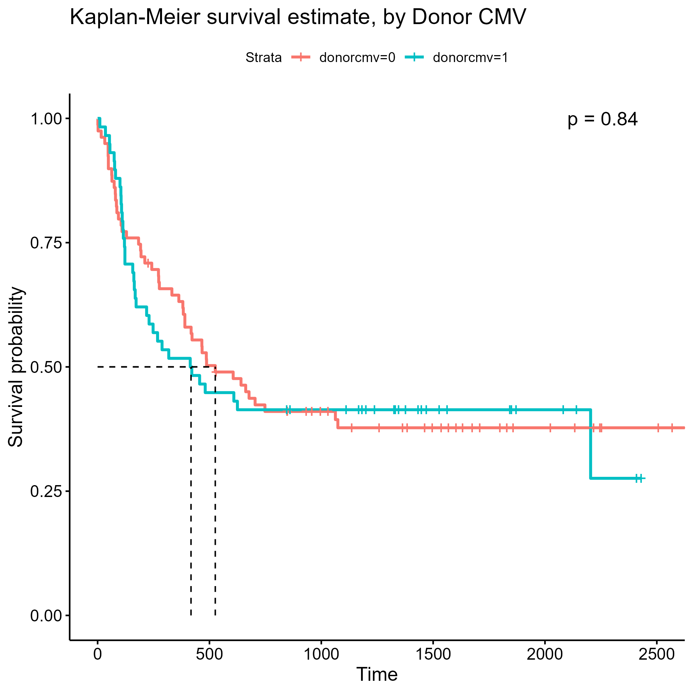

\fontsize{11}{16}
\selectfont

```{r echo=FALSE, warning=FALSE, message=FALSE, include=FALSE}

knitr::opts_chunk$set(echo=FALSE)

source("code.R")

```

# Introduction


# Methods 

## Terminating Event and Time

Our team was tasked with identifying associations and trends in survival times with two separate terminating events. In directives 1-5, where our objectives revolved around disease free survival time, our team identified *deltadfs* as the terminating event of interest. This terminating event is a binary indicator of death or relapse of disease among our patient sample. In directives 6-7, the research question shifted to the developmental risk of acute graft-versus-host disease (aGVHD) in our patient sample, and thus, the binary indicator of aGVHD onset *deltaa* was chosen as our terminating event.

Approaching the data with the research question of disease free survival time in mind, our team decided to classify *tdfs*, the time in days until death, relapse, or censoring, as the time argument when analyzing directives 1-5. The research question of directives 6 and 7 handles the time until onset of acute graft-versus-host disease, and thus *ta*, the time in days until onset of aGVHD was used as the time argument in the respective survival objects.

## Significance and Family-wise Error

Given our fairly low clinical sample size of $n = 137$ patients, our tests of significance will have lower power of detecting true differences in groups if they exist. Based on this and observations of significance from Thiese, Ronna, and Ott (Thiese et al. 2016), we deliberately set our significance level to an unconservative $\alpha = .1$. This large significance level allows us to account for our small sample size, in addition, it will allowing us to correct for the family-wise error we will encounter through multiple testing without over-correcting with a practically unrejectable p-value. We chose to correct for family-wise error through a Bonferroni correction. In directives 2 and 3, we run 8 log-rank hypothesis tests of significance. Thus, our family-wise error adjusted significance level of rejection will be $\frac{.1}{8} = .0125$. 


## Test Statistics

To test the survival time and onset time differences between groups, we will be using the log-rank test as an *a priori* choice of statistic based on what we believe are appropriate scientific considerations. We don't believe there to be any basis on which to weigh early terminations more heavily, thus we do not see the Gehan-Breslow generalized Wilcoxon statistic as appropriate. Additionally, we expect to see proportional hazards among our disease and FAB groups because why would we learn those methods all quarter and not get a data set where we can utilize those skills. Thus, the log-rank test statistic will be used as our method of nonparametric testing of equal survivorship between groups.

# Results and Discussion


## Descriptive Statistics


## Proportional Hazards


## Limitations


# Tables and Figures


# References 

Thiese MS, Ronna B, Ott U. P value interpretations and considerations. J Thorac Dis. 2016 Sep;8(9):E928-E931. doi: 10.21037/jtd.2016.08.16. PMID: 27747028; PMCID: PMC5059270.

```{r fig.cap = "Kaplan-Meier Estimate, Disease Free Survival Time", fig.show='hold',fig.align='center', out.width="60%", out.height="50%"}

knitr::include_graphics("Plots/km_dir1_plot.png")

```

```{r fig.cap = "Weibull and GGamma Estimates, Disease Free Survival Time", fig.show='hold',fig.align='center', out.width="49%", out.height="30%"}

knitr::include_graphics(c("Plots/weibull_dir1_plot.png",
                          "Plots/ggamma_dir1_plot.png"))

```

```{r fig.cap = "Kaplan-Meier Estimate, Disease Free Survival Time", fig.show='hold',fig.align='center', out.width="60%", out.height="50%"}

knitr::include_graphics("Plots/disgroup_dir2_plot.png")

```

```{r fig.cap = "Disease Group Table", fig.show='hold',fig.align='center', out.width="60%", out.height="50%"}

pander(survdiff(s_bmt ~ disgroup, data = bmt_df))

```

```{r fig.cap = "Kaplan-Meier Estimate, Disease Free Survival Time", fig.show='hold',fig.align='center', out.width="60%", out.height="50%"}


```

```{r fig.cap = "Disease Group Table", fig.show='hold',fig.align='center', out.width="60%", out.height="50%"}

pander(survdiff(s_bmt ~ fab, data = bmt_df))

```

```{r fig.cap = "Kaplan-Meier Estimate, Disease Free Survival Time", fig.show='hold',fig.align='center', out.width="60%", out.height="50%"}

knitr::include_graphics("Plots/bymale_dir3_plot.png")

```

```{r fig.cap = "Disease Group Table", fig.show='hold',fig.align='center', out.width="60%", out.height="50%"}

pander(survdiff(s_bmt ~ male, data = bmt_df))

```

```{r fig.cap = "Kaplan-Meier Estimate, Disease Free Survival Time", fig.show='hold',fig.align='center', out.width="60%", out.height="50%"}

knitr::include_graphics("Plots/byCMV_dir3_plot.png")

```

```{r fig.cap = "Disease Group Table", fig.show='hold',fig.align='center', out.width="60%", out.height="50%"}

pander(survdiff(s_bmt ~ cmv, data = bmt_df))

```

```{r fig.cap = "Kaplan-Meier Estimate, Disease Free Survival Time", fig.show='hold',fig.align='center', out.width="60%", out.height="50%"}

knitr::include_graphics("Plots/byDonerMale_dir3_plot.png")

```

```{r fig.cap = "Disease Group Table", fig.show='hold',fig.align='center', out.width="60%", out.height="50%"}

pander(survdiff(s_bmt ~ donormale, data = bmt_df))

```

```{r fig.cap = "Kaplan-Meier Estimate, Disease Free Survival Time", fig.show='hold',fig.align='center', out.width="60%", out.height="50%"}



```

```{r fig.cap = "Disease Group Table", fig.show='hold',fig.align='center', out.width="60%", out.height="50%"}

pander(survdiff(s_bmt ~ donorcmv, data = bmt_df))

```

```{r fig.cap = "Kaplan-Meier Estimate, Disease Free Survival Time", fig.show='hold',fig.align='center', out.width="60%", out.height="50%"}


```

```{r fig.cap = "Disease Group Table", fig.show='hold',fig.align='center', out.width="60%", out.height="50%"}

pander(survdiff(s_bmt ~ hospital, data = bmt_df))

```

```{r fig.cap = "Kaplan-Meier Estimate, Disease Free Survival Time", fig.show='hold',fig.align='center', out.width="60%", out.height="50%"}


```

```{r fig.cap = "Disease Group Table", fig.show='hold',fig.align='center', out.width="60%", out.height="50%"}

pander(survdiff(s_bmt ~ mtx, data = bmt_df))

```

```{r fig.cap = "Kaplan-Meier Estimate, Disease Free Survival Time", fig.show='hold',fig.align='center', out.width="60%", out.height="50%"}

knitr::include_graphics("Plots/byMTX_dir5_plot.png")

```

```{r fig.cap = "Kaplan-Meier Estimate, Disease Free Survival Time", fig.show='hold',fig.align='center', out.width="60%", out.height="50%"}

knitr::include_graphics("Plots/byCMV_dir5_plot.png")

```

```{r fig.cap = "Kaplan-Meier Estimate, Disease Free Survival Time", fig.show='hold',fig.align='center', out.width="60%", out.height="50%"}

knitr::include_graphics("Plots/byHosptial_dir5_plot.png")

```

```{r fig.cap = "Kaplan-Meier Estimate, Disease Free Survival Time", fig.show='hold',fig.align='center', out.width="60%", out.height="50%"}

knitr::include_graphics("Plots/byDonorCMV_dir5_plot.png")

```

```{r fig.cap = "Kaplan-Meier Estimate, Disease Free Survival Time", fig.show='hold',fig.align='center', out.width="60%", out.height="50%"}

knitr::include_graphics("Plots/byMTX_dir6_plot.png")

```


