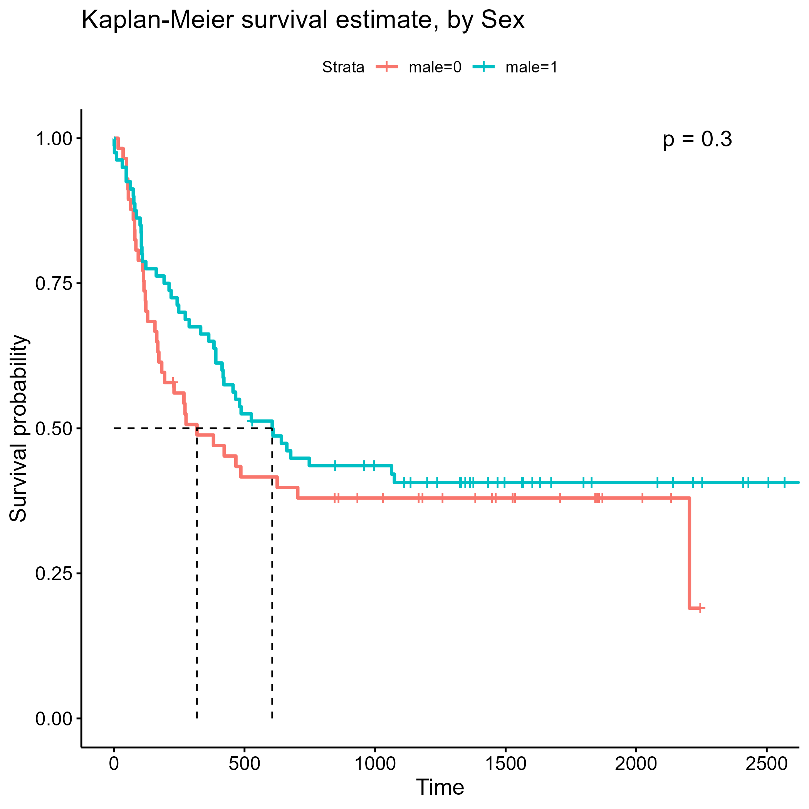
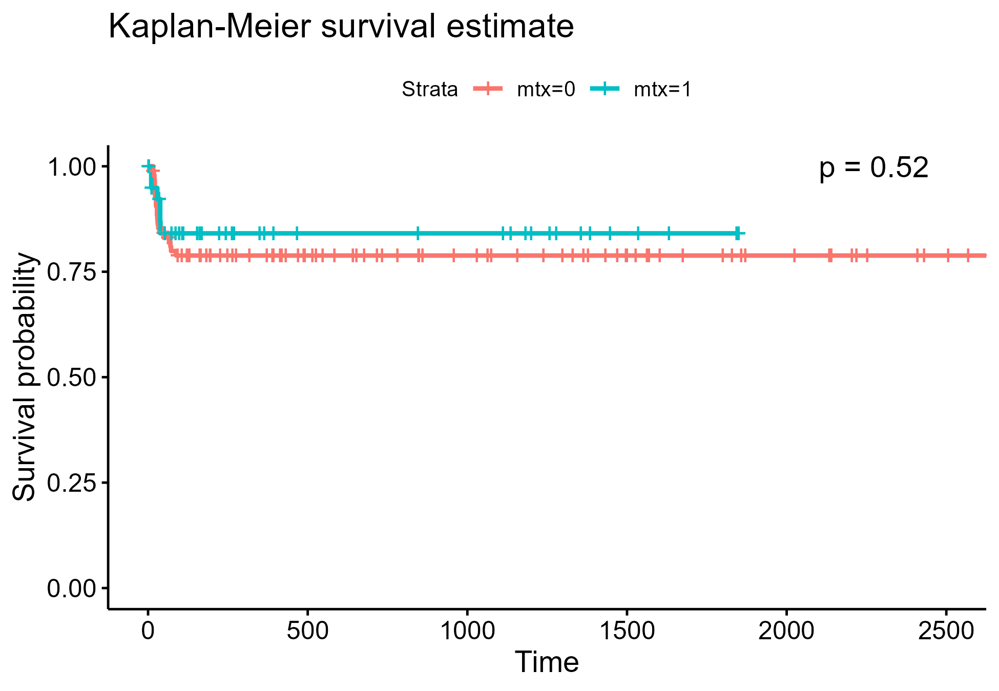

\fontsize{11}{14}
\selectfont

```{r echo=FALSE, warning=FALSE, message=FALSE, include=FALSE}

knitr::opts_chunk$set(echo=FALSE)

source("code.R")

```

# Introduction

Acute leukemias are blood and bone marrow cancers that include eight subtypes of acute myeloid leukemia (AML) and three subtypes of acute lymphocytic leukemia (ALL). Treatment for acute leukemia may include bone marrow transplant. For some people, bone marrow transplantation may cure their disease, but recovery after transplantation is a complex process. Prognosis after bone marrow transplantation likely depends on both patient factors and donor factors and is dynamic given the occurrence of events such as acute graft-versus-host disease (aGVHD) and recovery of normal platelet counts. For the purposes of our study, we will consider relapse of leukemia or patient death during remission as failure of transplantation events. We aim to conduct an exploratory analysis of patient factors, donor factors, and clinical events that may be predictive of survival after allogeneic transplant. Specifically, we aim to:

* Provide an estimate of disease-free survival in our study population
* Describe measured baseline variables of patient age, patient sex, donor age, donor sex, patient cytomegalovirus (CMV) immune status, donor CMV immune status, wait time from diagnosis to transplant, and use of methotrexate prophylaxis among disease groups and among French-American-British (FAB) subtypes of leukemia in our study population
* Explore whether any of the measured baseline variables are associated with differences in disease-free survival
* Explore whether occurrence of aGVHD is associated with improved disease-free survival or decreased risk of relapse to determine whether it is an important prognostic event
* Explore whether any of the measured baseline variables are associated with differences in disease-free survival among patients who develop aGVHD
* Explore whether use of prophylactic methotrexate is associated with the risk of developing aGVHD, adjusting for potential confounding from other baseline variables
* Explore whether recovery of normal platelet levels is associated with improved disease-free survival or decreased risk of relapse
* A total of 137 patients were enrolled after allogeneic bone marrow transplantation at four different hospitals in the United States and Australia between March 1, 1984 and June 30 1989. All patients were followed until death or end of the study.


# Methods 

## Terminating Event and Time

Our team was tasked with identifying associations and trends in survival times with two separate terminating events. In directives 1-5, where our objectives revolved around disease free survival time, our team identified *deltadfs* as the terminating event of interest. This terminating event is a binary indicator of death or relapse of disease among our patient sample. In directives 6-7, the research question shifted to the developmental risk of acute graft-versus-host disease (aGVHD) in our patient sample, and thus, the binary indicator of aGVHD onset *deltaa* was chosen as our terminating event.

Approaching the data with the research question of disease free survival time in mind, our team decided to classify *tdfs*, the time in days until death, relapse, or censoring, as the time argument when analyzing directives 1-5. The research question of directives 6 and 7 handles the time until onset of acute graft-versus-host disease, and thus *ta*, the time in days until onset of aGVHD was used as the time argument in the respective survival objects.

## Significance and Family-wise Error

Given our fairly low clinical sample size of $n = 137$ patients, our tests of significance will have lower power of detecting true differences in groups if they exist. Based on this and observations of significance from Thiese, Ronna, and Ott (Thiese et al. 2016), we deliberately set our significance level to an unconservative $\alpha = .1$. This large significance level allows us to account for our small sample size, in addition, it will allowing us to correct for the family-wise error we will encounter through multiple testing without over-correcting with a practically unrejectable p-value. We chose to correct for family-wise error through a Bonferroni correction. In directives 2 and 3, we run 8 log-rank hypothesis tests of significance. Thus, our family-wise error adjusted significance level of rejection will be $\frac{.1}{8} = .0125$. 


## Test Statistics

To test the survival time and onset time differences between groups, we will be using the log-rank test as an ###*a priori*### choice of statistic based on what we believe are appropriate scientific considerations. We don't believe there to be any basis on which to weigh early terminations more heavily, thus we do not see the Gehan-Breslow generalized Wilcoxon statistic as appropriate. Additionally, we expect to see proportional hazards among our disease and FAB groups because why would we learn those methods all quarter and not get a data set where we can utilize those skills. Thus, the log-rank test statistic will be used as our method of nonparametric testing of equal survivorship between groups.

# Results and Discussion


## Descriptive Statistics

This data set includes 137 patients, of which 39% are censored for our chosen terminating event of death or relapse of disease. The mean age is approximately 28 years old, and there are 58.4% males in the data set. 49.6% of our patients have positive cytomegalovirus (CMV) immune status, while 29.2% report prophylactic use of methotrexate (MTX). We also collected similar biomarker predictors on our donor sample, and for the same covariates of mean donor age, proportion male, and proportion CMV status, we measured ~ 28 years old, 64.2%, and 42.3% respectively. 

## Directive 1

When attempting to *estimate the disease-free survival time for patients enrolled in this study*, we first plotted *(figure 1)* the non-parametric Kaplan-Meier estimator in an attempt to gain knowledge of the underlying shape of our data. The estimated median survival time was **481 [363, 748] days**. The curve made us hopeful to use a parametric estimator. We began with a Weibull and generalized gamma estimate, which we plotted *(figure 2)* in conjunction with the Kaplan-Meier to eye-test it's effectiveness at modeling the data. Using a likelihood ratio test, we can empirically answer if the Weibull is an appropriate simplification of the generalized gamma, in which case we will use the Weibull's parameter estimates. The LRT test statistic can be computed as

$2 \times (657.77 − 650.19) ≈ 15.16$

which signifies with a p-value $9.88 \times 10^{-5}$ that the Weibull distribution is not a appropriate simplification of the generalized gamma with our data. We can see that with the scale $p = 0.59 \space [0.48, .70]$ and shape $\lambda = .0007 \space [0004, 0009]$ parameters of the Weibull distribution resulting in a large maximized loglikelihood value of -657.77, we do not have a good fit. However, the parameter estimations of the gamma don't fair much better given the maximized loglikelihood value of -650.19. The parameters for the generalized gamma are as follows, $\mu = 6.23 \space [5.52, 6.94]$ $\sigma = 2.31 \space [1.89, 2.74]$, and $Q = -0.4 \space [-1.06, .27]$. Given the poor likelihood values for even the most robut of parametric estimators, we elect a non-parametric estimate in the form of the Kaplan-Meier estimator. This allows us to provide estimates like the median survival time as described prior.

## Proportional Hazards


## Limitations

# References 

Thiese MS, Ronna B, Ott U. P value interpretations and considerations. J Thorac Dis. 2016 Sep;8(9):E928-E931. doi: 10.21037/jtd.2016.08.16. PMID: 27747028; PMCID: PMC5059270.

# Tables and Figures

```{r fig.cap = "Kaplan-Meier Estimate, Disease Free Survival Time", fig.show='hold',fig.align='center', out.width="60%", out.height="50%"}

knitr::include_graphics("Plots/km_dir1_plot.png")

```

```{r fig.cap = "Weibull and GGamma Estimates, Disease Free Survival Time", fig.show='hold',fig.align='center', out.width="49%", out.height="30%"}

knitr::include_graphics(c("Plots/weibull_dir1_plot.png",
                          "Plots/ggamma_dir1_plot.png"))

```

```{r fig.cap = "Kaplan-Meier Estimate, Disease Free Survival Time", fig.show='hold',fig.align='center', out.width="60%", out.height="50%"}

knitr::include_graphics("Plots/disgroup_dir2_plot.png")

```

```{r fig.cap = "Disease Group Table", fig.show='hold',fig.align='center', out.width="60%", out.height="50%"}

pander(survdiff(s_bmt ~ disgroup, data = bmt_df))

```

```{r fig.cap = "Kaplan-Meier Estimate, Disease Free Survival Time", fig.show='hold',fig.align='center', out.width="60%", out.height="50%"}

knitr::include_graphics("Plots/FAB_dir2_plot.png")

```

```{r fig.cap = "Disease Group Table", fig.show='hold',fig.align='center', out.width="60%", out.height="50%"}

pander(survdiff(s_bmt ~ fab, data = bmt_df))

```

```{r fig.cap = "Kaplan-Meier Estimate, Disease Free Survival Time", fig.show='hold',fig.align='center', out.width="60%", out.height="50%"}



```

```{r fig.cap = "Disease Group Table", fig.show='hold',fig.align='center', out.width="60%", out.height="50%"}

pander(survdiff(s_bmt ~ male, data = bmt_df))

```

```{r fig.cap = "Kaplan-Meier Estimate, Disease Free Survival Time", fig.show='hold',fig.align='center', out.width="60%", out.height="50%"}

knitr::include_graphics("Plots/byCMV_dir3_plot.png")

```

```{r fig.cap = "Disease Group Table", fig.show='hold',fig.align='center', out.width="60%", out.height="50%"}

pander(survdiff(s_bmt ~ cmv, data = bmt_df))

```

```{r fig.cap = "Kaplan-Meier Estimate, Disease Free Survival Time", fig.show='hold',fig.align='center', out.width="60%", out.height="50%"}

knitr::include_graphics("Plots/byDonerMale_dir3_plot.png")

```

```{r fig.cap = "Disease Group Table", fig.show='hold',fig.align='center', out.width="60%", out.height="50%"}

pander(survdiff(s_bmt ~ donormale, data = bmt_df))

```

```{r fig.cap = "Kaplan-Meier Estimate, Disease Free Survival Time", fig.show='hold',fig.align='center', out.width="60%", out.height="50%"}

knitr::include_graphics("Plots/byDonerCMV_dir3_plot.png")

```

```{r fig.cap = "Disease Group Table", fig.show='hold',fig.align='center', out.width="60%", out.height="50%"}

pander(survdiff(s_bmt ~ donorcmv, data = bmt_df))

```

```{r fig.cap = "Kaplan-Meier Estimate, Disease Free Survival Time", fig.show='hold',fig.align='center', out.width="60%", out.height="50%"}

knitr::include_graphics("Plots/byHosptial_dir3_plot.png")

```

```{r fig.cap = "Disease Group Table", fig.show='hold',fig.align='center', out.width="60%", out.height="50%"}

pander(survdiff(s_bmt ~ hospital, data = bmt_df))

```

```{r fig.cap = "Kaplan-Meier Estimate, Disease Free Survival Time", fig.show='hold',fig.align='center', out.width="60%", out.height="50%"}

knitr::include_graphics("Plots/byMTX_dir3_plot.png")

```

```{r fig.cap = "Disease Group Table", fig.show='hold',fig.align='center', out.width="60%", out.height="50%"}

pander(survdiff(s_bmt ~ mtx, data = bmt_df))

```

```{r fig.cap = "Kaplan-Meier Estimate, Disease Free Survival Time", fig.show='hold',fig.align='center', out.width="60%", out.height="50%"}

knitr::include_graphics("Plots/byMTX_dir5_plot.png")

```

```{r fig.cap = "Kaplan-Meier Estimate, Disease Free Survival Time", fig.show='hold',fig.align='center', out.width="60%", out.height="50%"}

knitr::include_graphics("Plots/byCMV_dir5_plot.png")

```

```{r fig.cap = "Kaplan-Meier Estimate, Disease Free Survival Time", fig.show='hold',fig.align='center', out.width="60%", out.height="50%"}

knitr::include_graphics("Plots/byHosptial_dir5_plot.png")

```

```{r fig.cap = "Kaplan-Meier Estimate, Disease Free Survival Time", fig.show='hold',fig.align='center', out.width="60%", out.height="50%"}

knitr::include_graphics("Plots/byDonorCMV_dir5_plot.png")

```

```{r fig.cap = "Kaplan-Meier Estimate, Disease Free Survival Time", fig.show='hold',fig.align='center', out.width="60%", out.height="50%"}



```


